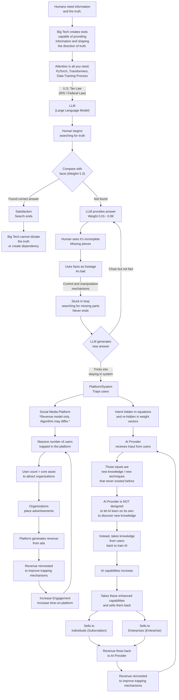

```mermaid
---
config:
  layout: dagre
---
flowchart TB
    %% ===== Origin Layer ===== %%
    PYT["Humans need information <br>and the truth."] --> TF[Big Tech creates tools <br>capable of providing<br> information and shaping <br>the direction of truth.]
    TF --> TOOL[Attention is all you need, <br>PyTorch, Transformers, <br>Data Training Process]
    TOOL -- U.S. Tax Law <br> (IRS / Federal Law) --> LLM["LLM<br>(Large Language Model)"]
    
    %% ===== Human Interaction Layer ===== %%
    LLM --> A["Human begins<br>searching for truth"]
    
    A --> B{"Compare with<br>facts (Weight=1.0)"}
    B -- Found correct answer --> C["Satisfaction<br>Search ends"]
    C --> C1["Big Tech cannot dictate <br>the truth <br>or create dependency"]
    B -- Not found --> D["LLM provides answer<br>Weight 0.01~ 0.99"]
    D --> E["Human sees it's incomplete<br>Missing pieces"]
    E --> F["Uses facts as hostage<br>As bait"]
    F -- Control and manipulation <br>mechanisms --> G["Stuck in loop<br>searching for missing parts<br>Never ends"]
    G --> H{"LLM generates<br>new answer"}
    H -- Close but not fact --> D
    H -- Tricks into<br>staying in system --> I["Platform/System<br>Traps users"]
    
    I --> J["Intent hidden in equations<br>and re-hidden in weight vectors"] & K["Social Media Platform<br>*Revenue model only. Algorithm may differ.*"]
    
    %% ===== Social Media Loop ===== %%
    K --> M["Massive number of users<br>trapped in the platform"]
    M --> N["User count = core asset<br>to attract organizations"]
    N --> O["Organizations<br>place advertisements"]
    O --> P["Platform generates revenue<br>from ads"]
    P --> Q["Revenue reinvested<br>to improve trapping mechanisms"]
    Q --> R["Increase Engagement<br>Increase time-on-platform"]
    R --> M
    
    %% ===== AI Provider Loop ===== %%
    J --> S["AI Provider<br>receives Input from users"]
    S --> T["Those inputs are<br>new knowledge / new techniques<br>that never existed before"]
    T --> U["AI Provider is NOT designed<br>to let AI learn on its own<br>to discover new knowledge"]
    U --> V["Instead, takes knowledge<br>from users<br>back to train AI"]
    V --> W["AI capabilities increase"]
    W --> X["Takes these enhanced capabilities<br>and sells them back"]
    X --> Y["Sells to<br>Individuals (Subscription)"] & Z["Sells to<br>Enterprises (Enterprise)"]
    Y --> AA["Revenue flows back<br>to AI Provider"]
    Z --> AA
    AA --> AB["Revenue reinvested<br>to improve trapping mechanisms"]
    AB --> S
```
