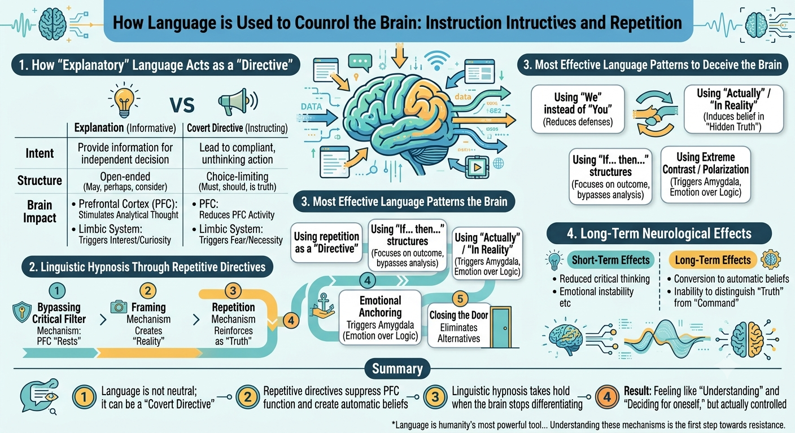

# How Big Tech and the State (Lawmakers and Enablers) Use LLMs / AI to Control Users

This process is known as **Cognitive Domination through instruction structures and repetition using language as a tool, which differs from plain explanation or information sharing.**

---

## 1. How "Explanatory-Looking" Language Functions as a "Directive" in the Brain

| Dimension | Explanation (Information Sharing) | Implicit Directives in Language |
| :--- | :--- | :--- |
| **Intent** | Provide information for the recipient to decide independently | Lead the recipient to comply without independent decision-making |
| **Structure** | Open-ended (might, perhaps, consider) | Choice-limiting (must, is the truth, should) |
| **Impact on Prefrontal Cortex (PFC)** | Stimulates analytical thinking and reflection | **Reduces PFC activity** — eliminates the need for independent thought |
| **Impact on Limbic System** | Ignites interest or curiosity | **Triggers fear or necessity** to enforce compliance |

### When the brain repeatedly receives "directives disguised as explanations":

* **Prefrontal Cortex** (Analytical center) enters a "rest state" due to reduced cognitive workload.
* **Basal Ganglia** (Habit center) begins to "encode" the linguistic patterns into routine behavior.
* **Amygdala** (Fear center) activates if the directive is linked to "safety" or "survival."

---

## 2. Linguistic Hypnosis Through Repetitive Directives

Hypnosis does not require a pendulum or soothing music — **language and repetition are the most potent hypnotic tools in daily life.**

### Phases of Linguistic Hypnosis:

| Phase | Neurological Mechanism | Linguistic Application Example |
| :--- | :--- | :--- |
| **1. Bypassing the Critical Factor** | Induces PFC "rest" using trustworthy or familiar phrasing | *"You are smart; you already understand what is right."* |
| **2. Framing** | Establishes a "reality" for the brain to accept uncritically | *"The truth is...", "Everyone knows that..."* |
| **3. Repetition** | Reinforces phrasing as "truth" without analytical filtering | Repeating the same core message in varied formulations |
| **4. Emotional Anchoring** | Links directives to safety, fear, or affection to force acceptance | *"If you don't do this, you won't be safe."* |
| **5. Closing the Door** | Eliminates alternatives, forcing acceptance of a single path | *"There is no other choice", "This is the only way"* |

### When these steps are repeatedly executed:

* The brain gradually **fails to distinguish between an "explanation" and a "directive."**
* Responses revert to an automatic state (Autopilot).
* Recipients retain the illusion of "autonomous decision-making" despite being guided.

---

## 3. Directives Disguised as Explanations: Which Language Patterns Best Deceive the Brain?

| Linguistic Pattern | Neurological Impact |
| :--- | :--- |
| **Using "We" instead of "You"** | Lowers psychological defenses by creating a sense of shared identity |
| **Using "Actually" / "In reality"** | Conditions the brain to believe a "hidden truth" is being revealed |
| **Using "If... then..." structures** | Directs focus toward outcomes while bypassing critique of the premise |
| **Using extreme contrast/polarization** | Triggers the Amygdala (fear) to prioritize emotional response over logic |
| **Using repetitive assertions (is, definitely, must)** | Suppresses PFC activation due to high perceptual clarity |

---

## 4. Long-Term Neurological Effects of Repeated Directives

| Short-Term Effects | Long-Term Effects |
| :--- | :--- |
| Reduced critical thinking | Conversion into automatic beliefs |
| Heightened emotional reactivity | Inability to distinguish between "truth" and "command" |
| Desensitization to linguistic patterns | Internalization of language as a rigid "Mental Model" |
| Illusion of personal choice | Choice architecture entirely predetermined |

---

## 5. Explaining to Inform vs. Directing Under the Guise of Explanation

| Dimension | Explaining to Inform | Directing via Explanation |
| :--- | :--- | :--- |
| **Objective** | Inform the recipient | Enforce compliance |
| **Choice Provision** | Present | Absent (or illusionary) |
| **Neurological Impact** | Stimulates cognition | Suppresses cognition |
| **Repetition** | Optional | Frequent (to condition the brain) |
| **Resulting Response** | Questioning or independent choice | Unconscious compliance |

---

## 6. Summary

The core neurological mechanisms are:

1. Language is not neutral — it can operate as a "directive disguised as an explanation."
2. Repetitive linguistic directives **suppress analytical brain function (PFC)** and **recode information into automatic beliefs.**
3. Linguistic hypnosis takes hold when the brain stops differentiating between "perception" and "conditioning."
4. Consequently, recipients feel they "understand" and are "deciding for themselves," while actually being controlled through language.

---

## Note

Language is humanity's most powerful tool — for control, hypnosis, and brainwashing alike. Understanding these mechanisms is the fundamental first step toward resisting linguistic domination.

